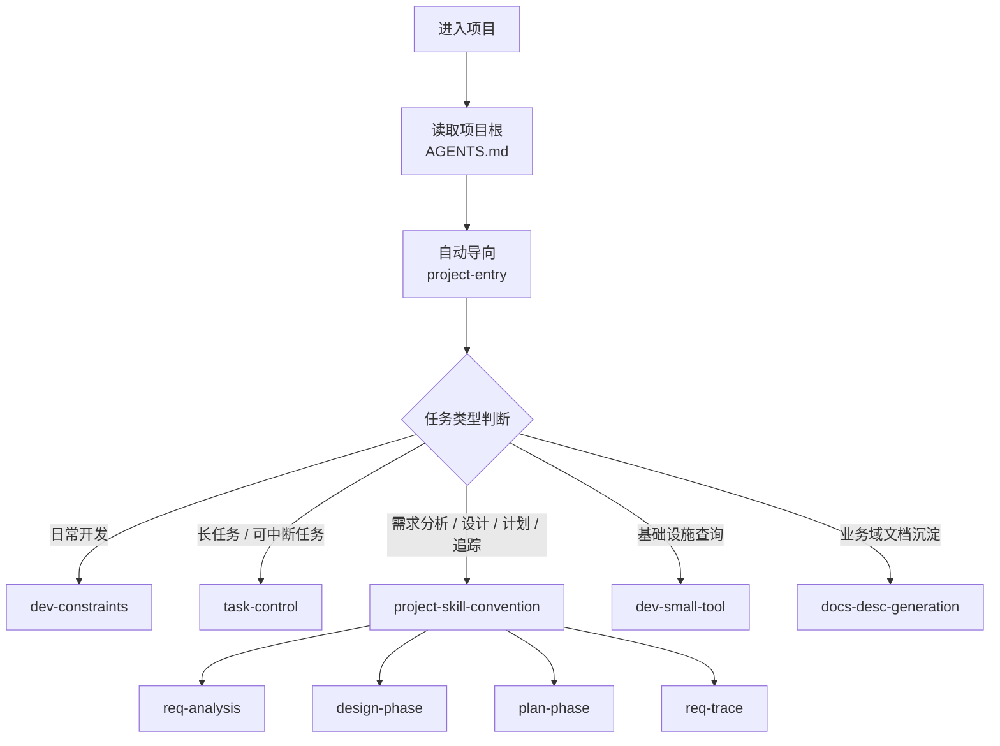

# Codex 中文全局技能工程

这是一个可直接用于 Codex 的中文 starter kit，用来提供统一的开发约束、任务持久化、项目协作公约，以及项目级入口与自动分流能力。

## 目标

- 提供一套可直接安装到 `~/.codex/skills` 的中文技能集合
- 提供项目根 `AGENTS.md` 入口，形成统一的项目工作入口
- 提供需求分析、设计、计划、实现、追踪的完整协作链路
- 提供长任务恢复、项目知识沉淀、基础设施查询等常见能力
- 提供适合团队内部分发和二次复用的纯净 starter kit

## 目录结构

```text
codex-skill-starter-kit/
├── README.md
├── 新项目接入手册.md
├── scripts/
│   └── install_starter_kit.py
├── templates/
│   └── project/
│       └── AGENTS.md
├── examples/
│   └── minimal-project/
└── skills/
    ├── design-phase/
    ├── dev-constraints/
    ├── dev-small-tool/
    ├── docs-desc-generation/
    ├── plan-phase/
    ├── project-entry/
    ├── project-skill-convention/
    ├── req-analysis/
    ├── req-trace/
    ├── session-cleanup/
    ├── starter-kit-backup/
    ├── starter-kit-guide/
    ├── starter-kit-import/
    └── task-control/
```

## 快速安装

```bash
python scripts/install_starter_kit.py
```

如果本机同时装了多个 Python，或 `python` 指向的不是 Python 3，优先使用：

```bash
py -3 scripts/install_starter_kit.py
```

常用参数：
- `--dry-run`：仅预览，不实际复制
- `--overwrite`：覆盖目标目录中的同名技能
- `--target <目录>`：安装到自定义 Codex 技能目录
- `--init-project <项目目录>`：在项目根初始化 `AGENTS.md`、`docs/codex/v1/` 骨架和 `.codex/plans/main/TASKS.md`
- `--project-overwrite`：覆盖项目中已有的 `AGENTS.md`

推荐一次完成全局安装和项目接入：

```bash
python scripts/install_starter_kit.py --overwrite --init-project .
```

## 项目入口流程图



## 阶段流转图


## 实际项目怎么用

推荐用法：
1. 先把技能安装到 `~/.codex/skills/`
2. 再用 `--init-project` 把 `AGENTS.md` 初始化到目标项目根目录
3. 进入项目后，直接按真实任务描述需求，不必手动点名每个技能
4. 让项目根 `AGENTS.md` 先把任务导向 `project-entry`
5. 再由 `project-entry` 自动分流到对应技能链路

## 实际项目任务示例

### 1. 修线上 bug

你可以直接对 Codex 说：

```text
请按项目规则排查订单回调偶发重复入账的问题，先定位根因，再修复代码并补充必要验证。
```

典型流转：

```text
AGENTS.md -> project-entry -> dev-constraints
```

如果问题比较大、需要多轮推进，通常还会接入：

```text
task-control
```

### 2. 新需求分析

```text
请按项目规则分析“新增优惠券冻结与释放机制”这个需求，输出 requirements 文档，并把关键边界条件写清楚。
```

典型流转：

```text
AGENTS.md -> project-entry -> project-skill-convention -> req-analysis
```

### 3. 输出技术设计

```text
请基于现有 requirements，为“优惠券冻结与释放机制”输出技术设计，包含数据结构、接口变更、异常回滚和兼容策略。
```

典型流转：

```text
AGENTS.md -> project-entry -> project-skill-convention -> design-phase
```

### 4. 拆执行计划

```text
请按项目规则把这个设计拆成执行计划，明确阶段、负责人视角、风险点和验证项。
```

典型流转：

```text
AGENTS.md -> project-entry -> project-skill-convention -> plan-phase
```

### 5. 继续一个长任务

```text
请按项目规则恢复上次中断的会员积分改造任务，先读取已有任务记录，再继续推进未完成项。
```

典型流转：

```text
AGENTS.md -> project-entry -> dev-constraints -> task-control
```

### 6. 查基础设施信息

```text
请按项目规则帮我确认 user_profile 表结构、相关索引和当前环境里的 Nacos 配置项。
```

典型流转：

```text
AGENTS.md -> project-entry -> dev-small-tool
```

### 7. 沉淀业务域文档

```text
请按项目规则梳理结算域的核心对象、状态流转和上下游依赖，初始化 docs/desc 里的长期说明文档。
```

典型流转：

```text
AGENTS.md -> project-entry -> docs-desc-generation
```

### 8. 做闭环审查

```text
请按项目规则审查“优惠券冻结与释放机制”是否已经形成 requirements、design、plan、实现和验证的闭环，并指出缺口。
```

典型流转：

```text
AGENTS.md -> project-entry -> project-skill-convention -> req-trace
```

## 示例项目怎么用

`examples/minimal-project/` 已同步到最新版入口规则，可直接用来演示“自然语言任务 -> 自动识别 -> 进入对应流程”的效果。

推荐演示顺序：
1. 进入 `examples/minimal-project/`
2. 先说“请按项目入口规则初始化当前项目工作流，并补齐 AGENTS.md、docs/codex/v1 骨架和 .codex/plans/main/TASKS.md”
3. 再从示例项目 `README.md` 中复制一个任务示例进行测试
4. 观察 `AGENTS.md -> project-entry -> 对应技能链路` 的分流结果

## 包含的技能

- `project-entry`：项目入口与技能编排
- `dev-constraints`：开发约束
- `dev-small-tool`：基础设施只读查询
- `docs-desc-generation`：业务域文档生成
- `session-cleanup`：安全清理旧 Codex 会话
- `task-control`：长任务持久化与恢复
- `project-skill-convention`：需求、设计、计划、追踪协作公约
- `req-analysis`：把原始需求拆成结构化 requirements 文档
- `design-phase`：把需求落成技术设计文档
- `plan-phase`：把设计拆成执行计划文档
- `req-trace`：审查需求、设计、计划和实现是否闭环
- `starter-kit-import`：安装技能到 Codex 技能目录
- `starter-kit-backup`：导出可分享的 Codex 技能工程
- `starter-kit-guide`：解释这套技能工程的组成和用法

## 兼容说明

- 技能目录名和 frontmatter 中的 `name` 保留英文短名，这是为了兼容 Codex 当前的技能命名规则。
- 除技能 ID 外，其余可见说明、提示文案和安装输出均使用中文。
- 这是纯 Codex 技能工程，不依赖其他产品专属的 hook 或本地规则机制。
- 项目级自动触发依赖 Codex 可识别的项目根 `AGENTS.md`。
- 子代理继承通过项目规则协议和入口技能约束来实现，不是底层硬注入。
- 当前发布包不包含 `playwright-cli` / `playwright-init` 这一类可选增强能力。

## 常见显示问题

如果你在部分 Windows PowerShell 终端里看到中文显示成乱码，通常是终端编码页问题，不代表文件内容损坏。
当前安装脚本和项目初始化脚本生成的中文文件已使用更兼容 Windows 的 UTF-8 BOM 写入，但终端显示仍可能受本机编码页影响。

建议用以下方式确认：
- 用支持 UTF-8 的编辑器直接打开文件，例如 VS Code
- 或在 PowerShell 中切换到 UTF-8 编码后再查看
- 以安装脚本执行结果和编辑器打开结果为准，不以终端单次显示为准

## 附加资料

- `新项目接入手册.md`：新项目接入和真实任务示例说明
- `examples/minimal-project/`：可直接参考和演示的最小项目模板
