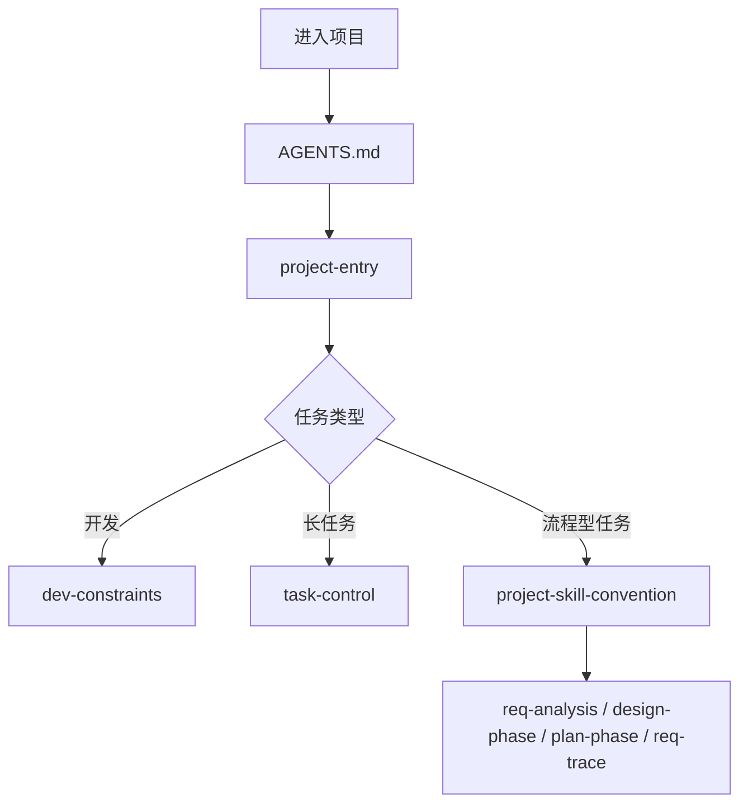
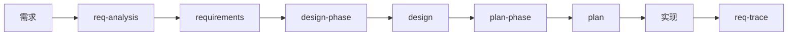
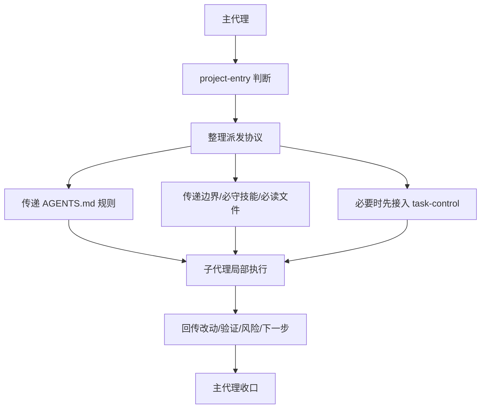

# Starter Kit 使用说明

只解释本技能工程，不做实际修改。

## 包含的技能

- `project-entry`：项目入口与技能编排
- `dev-constraints`：开发约束
- `dev-small-tool`：基础设施只读查询
- `docs-desc-generation`：业务域文档生成
- `session-cleanup`：安全清理旧 Codex 会话
- `task-control`：长任务持久化与恢复
- `project-skill-convention`：需求、设计、计划、追踪的统一公约
- `req-analysis`：需求拆解与 requirements 文档生成
- `design-phase`：技术设计文档生成
- `plan-phase`：实施计划文档生成
- `req-trace`：需求到实现的闭环追踪审查
- `starter-kit-import`：安装或复制本技能工程到 Codex 技能目录
- `starter-kit-backup`：把现有 Codex 技能打包成可分享的 starter kit

## 推荐入口

项目工作建议优先依赖项目根 `AGENTS.md` 自动进入 `$project-entry`；如果项目还没初始化规则文件，再手动从 `$project-entry` 进入。

它会根据任务类型，把请求分流到：

- 日常开发：`dev-constraints`
- 基础设施查询：`dev-small-tool`
- 业务域文档：`docs-desc-generation`
- 本地维护：`session-cleanup`
- 长任务：`task-control`
- 需求分析：`req-analysis`
- 技术设计：`design-phase`
- 执行计划：`plan-phase`
- 闭环追踪：`req-trace`

如果使用子代理或并行执行，也应继续遵守项目根 `AGENTS.md` 和入口技能给出的编排规则。

## 入口总览图

## 阶段流转图

## 子代理协作图

## 常见使用方式

- 日常开发：`project-entry -> dev-constraints`
- 基础设施查询：`project-entry -> dev-small-tool`
- 缺上下文时初始化业务域文档：`project-entry -> docs-desc-generation`
- 会话维护：`session-cleanup`
- 大任务、易中断任务：`project-entry -> dev-constraints -> task-control`
- 结构化交付流程：`project-entry -> req-analysis -> design-phase -> plan-phase -> 实现 -> req-trace`
- 子代理协作：主代理先按 `project-entry` 判断规则，再把边界、必读文件、必守技能、回传格式传给子代理
- 分享到另一台机器或团队：`starter-kit-backup` 后再 `starter-kit-import`

## 工程定位

- 这是一个纯 Codex 技能工程
- 通过技能目录直接组织和分发能力
- 依赖 Codex 的技能发现与显式调用方式工作
- 既可作为通用 starter kit，也可继续扩展成项目专用技能包
- 通过“项目根 `AGENTS.md` + project-entry”提供接近原版的项目级自动编排体验
- 通过项目规则协议尽量补足原版对子代理规则继承的能力